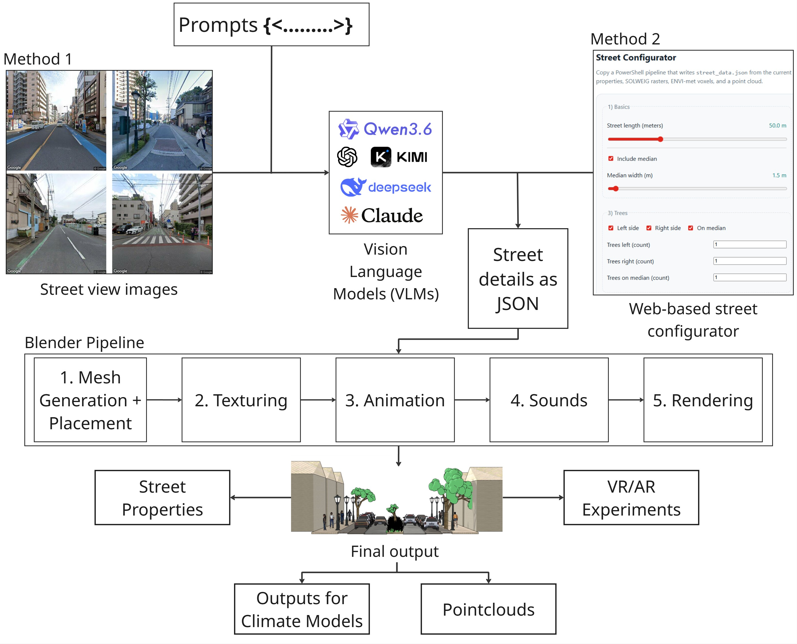
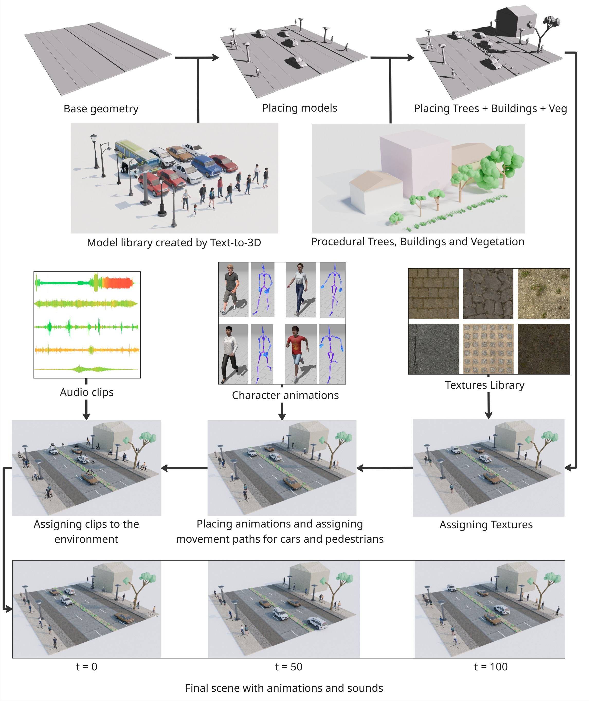
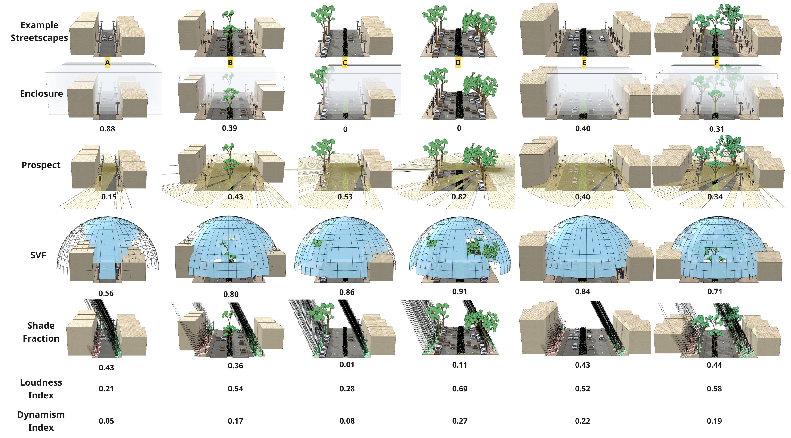
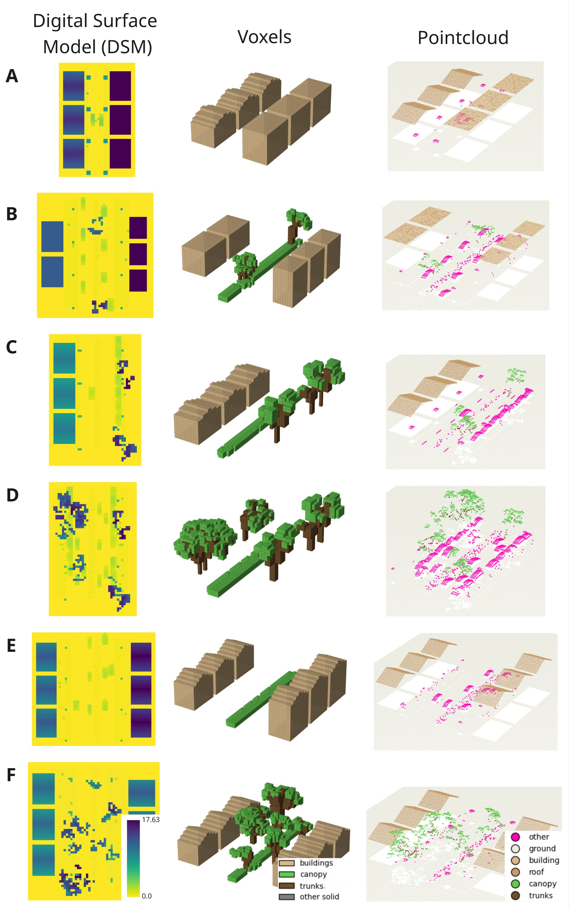

# StreetSim v1 

This project is aimed at generating procedural Blender street scenes.
It also exports analysis products such as property
visualizations, SOLWEIG rasters, ENVI-met voxel grids, and an
airborne-style point cloud.

<p align="center">
  
</p>
<p align="center"><em>Overall methodology</em></p>

## Setup [LLM-Based setup in progress]

Install Blender (tested in v4.5) and install the VLM/Python dependencies in the Anaconda environment you use for the
pipeline:

```cmd
pip install -r requirements.txt
```

Optional exporters and viewers use extra packages:

```cmd
pip install numpy matplotlib rasterio
```

`numpy` is needed for `.npz` ENVI-met and point-cloud bundles. `matplotlib` is
needed by `envimet_voxel_helper.py`. `rasterio` is only needed if you want
SOLWEIG GeoTIFF conversion; use `--solweig-skip-geotiff` to skip that part.

Make sure Ollama is running and that your vision model is available (tested with `llava:34b`):

```cmd
ollama serve
```

```cmd
ollama pull llava:34b
```

## Asset Pack

The large Blender assets are not included in this repository. Download the
asset pack zip from this Google Drive folder:

```text
https://drive.google.com/drive/folders/1hoYmdT2WJjhzd2ToD6f_T3pxULqlgokT?usp=sharing
```

Extract the archive into the project root so the asset folders sit alongside
the code folders:

```text
procedural/
  cars/
  people/
  lamp/
  mixamo_fbx/
  textures/
  sounds/
  modelling/
  properties/
  solweig/
  envimet/
  pointcloud/
```

## File Layout

The wrapper accepts the project root as `--scripts-dir` and searches the
standard subfolders automatically.

| Folder or file | Purpose |
|---|---|
| `run_image_to_blender.py` | Main image-to-scene wrapper |
| `cli.py` | Vision-only image to `street_data.json` |
| `street_configurator.html` | Browser configurator for manual scene setup |
| `modelling/` | Blender stages `01_model.py` through `05_render.py` |
| `properties/` | Property visualization and metrics scripts |
| `solweig/` | SOLWEIG raster export runner, exporter, and GeoTIFF conversion |
| `envimet/` | ENVI-met voxel export |
| `pointcloud/` | Airborne-style point-cloud export |
| `cars/`, `people/`, `lamp/`, `mixamo_fbx/`, `textures/`, `sounds/` | Downloaded asset folders used by Blender stages |

<p align="center">
  
</p>
<p align="center"><em>Blender pipeline</em></p>

## Full Pipeline

With no skip flags, the wrapper runs:

1. image to `street_data.json`
2. `modelling/01_model.py` to create `01_model.blend`
3. `modelling/02_textured.py` to create `02_textured.blend`
4. `modelling/03_animated.py` to create `03_animated.blend`
5. `modelling/04_soundscapes.py` to create `04_sounded.blend`
6. `modelling/05_render.py` to create the final render
7. property visualization images for enclosure, isovist, SVF, and shade
8. `street_metrics.json`
9. SOLWEIG raster export
10. ENVI-met voxel export
11. point-cloud export

Outputs are written into `--outdir`.

## Command Setup

Use Anaconda Prompt for the Python image-to-Blender pipeline. Set these
variables once in the same prompt; the later examples reuse them:

```cmd
set "PROJECT_DIR=C:\path\to\procedural"
set "IMAGE_PATH=C:\path\to\street_image.png"
set "OUT_DIR=C:\path\to\out_folder"
set "BLENDER_EXE=C:\path\to\blender.exe"
```

Set `BLENDER_EXE` to `blender` instead of a full path if Blender is already on
your PATH.

Run the full pipeline:

```cmd
python "%PROJECT_DIR%\run_image_to_blender.py" --image "%IMAGE_PATH%" --outdir "%OUT_DIR%" --blender "%BLENDER_EXE%" --scripts-dir "%PROJECT_DIR%" --assets-dir "%PROJECT_DIR%" --model llava:34b --ollama-url "http://localhost:11434/api/chat" --verbose --print-vision-summary --print-vision-json --render-mode render2
```

The commands in this README are single-line `cmd.exe` commands so they can be
pasted into Anaconda Prompt. Use PowerShell only for the browser configurator method generated by
`street_configurator.html`.

## Alternate Browser Configurator Method

Open the manual configurator in a browser:

```powershell
start .\street_configurator.html
```

Use this method when you want to choose the street properties manually instead
of using an input image and Ollama. In the browser form, keep
`Scripts folder` blank if PowerShell is opened in the project folder, or set it
to your project root:

```text
C:\path\to\procedural
```

Click `Copy PowerShell`, open PowerShell in the project folder, paste, and run
the generated script. The generated PowerShell now searches the project folders
recursively for stage scripts.

## Useful Pipeline Commands

Only create `street_data.json` and `01_model.blend`:

```cmd
python "%PROJECT_DIR%\run_image_to_blender.py" --image "%IMAGE_PATH%" --outdir "%OUT_DIR%" --blender "%BLENDER_EXE%" --scripts-dir "%PROJECT_DIR%" --assets-dir "%PROJECT_DIR%" --model llava:34b --skip-texture --skip-animate --skip-sound --skip-render --skip-property-images --skip-metrics-json --skip-solweig-export --skip-envimet-export --skip-pointcloud-export --verbose
```

Create scene and exports, but skip the final render:

```cmd
python "%PROJECT_DIR%\run_image_to_blender.py" --image "%IMAGE_PATH%" --outdir "%OUT_DIR%" --blender "%BLENDER_EXE%" --scripts-dir "%PROJECT_DIR%" --assets-dir "%PROJECT_DIR%" --model llava:34b --skip-render --verbose
```

Create a textured model and render a still image only:

```cmd
python "%PROJECT_DIR%\run_image_to_blender.py" --image "%IMAGE_PATH%" --outdir "%OUT_DIR%" --blender "%BLENDER_EXE%" --scripts-dir "%PROJECT_DIR%" --assets-dir "%PROJECT_DIR%" --model llava:34b --render-mode render2 --skip-animate --skip-sound --skip-property-images --skip-metrics-json --skip-solweig-export --skip-envimet-export --skip-pointcloud-export --verbose
```

## Important Arguments

| Argument | Meaning |
|---|---|
| `--image` | Input street-view image |
| `--outdir` | Output folder for JSON, `.blend` files, renders, and exports |
| `--blender` | Full path to `blender.exe`; defaults to `blender` if Blender is on PATH |
| `--scripts-dir` | Project root. The wrapper searches standard subfolders automatically |
| `--assets-dir` | Asset root for cars, lamps, people, textures, animations, and sounds. Defaults to `--scripts-dir` |
| `--model` | Ollama vision model, for example `llava:34b` |
| `--ollama-url` | Ollama chat API URL. Default: `http://localhost:11434/api/chat` |
| `--request-timeout` | Ollama timeout in seconds. Default: `600` |
| `--policy` | Optional JSON policy file |

## Skip Flags

| Flag | Skips |
|---|---|
| `--skip-texture` | `02_textured.py` |
| `--skip-animate` | `03_animated.py` |
| `--skip-sound` | `04_soundscapes.py` |
| `--skip-render` | `05_render.py` |
| `--skip-property-images` | enclosure, isovist, SVF, and shade images |
| `--skip-metrics-json` | `street_metrics.json` |
| `--skip-solweig-export` | SOLWEIG raster export |
| `--skip-envimet-export` | ENVI-met voxel export |
| `--skip-pointcloud-export` | point-cloud export |

## Render Options

| Argument | Values |
|---|---|
| `--render-mode render1` | Camera pan animation, MP4 |
| `--render-mode render2` | Still image, PNG |
| `--render-mode render3` | Clay/outlines image, PNG |
| `--render-outname` | Override final output filename |
| `--render-resx` | Render width in pixels, defaults to `640` for `render1` and `2048` for `render2`/`render3` |
| `--render-resy` | Render height in pixels, defaults to `480` for `render1` and `1536` for `render2`/`render3` |
| `--render-pan-deg` | Camera pan sweep for `render1`, defaults to `25` |
| `--render-pan-center-deg` | Center yaw for `render1`, defaults to `-90` to look along the street |
| `--render-rotations` | Optional full-spin override for `render1`; `1.0` is 360 degrees |
| `--render-exposure` | View exposure for `render1`, defaults to `-1.0` for half brightness |
| `--fps` | FPS for animation and render stages, defaults to `24` |
| `--duration` | Animation duration for `03_animated.py` |
| `--render-duration-s` | Render camera duration for `05_render.py`, defaults to `4` seconds |

Example:

```cmd
python "%PROJECT_DIR%\run_image_to_blender.py" --image "%IMAGE_PATH%" --outdir "%OUT_DIR%" --blender "%BLENDER_EXE%" --scripts-dir "%PROJECT_DIR%" --assets-dir "%PROJECT_DIR%" --model llava:34b --render-mode render2 --render-outname final_still.png
```

## Street Properties and image representation

By default, scripts calculate all the six properties in `street_metrics.json`, however four of them can be visualized:

```text
enclosure,isovist,svf,shade
```

Run only selected property images:

```text
--properties enclosure,shade
```

<p align="center">
  
</p>
<p align="center"><em>Street metrics calculation and visualization</em></p>

## SOLWEIG Export

SOLWEIG export is enabled by default. Disable it with:

```text
--skip-solweig-export
```

Common options:

| Argument | Default |
|---|---:|
| `--solweig-outdir` | `<outdir>\solweig_inputs` |
| `--solweig-cellsize` | `1.0` |
| `--solweig-padding` | `2.0` |
| `--solweig-epsg` | unset |
| `--solweig-skip-geotiff` | false |
| `--solweig-write-npy` | false |

Export SOLWEIG rasters from an existing `.blend`:

```cmd
"%BLENDER_EXE%" -b "%OUT_DIR%\04_sounded.blend" -P "%PROJECT_DIR%\solweig\solweig_export_rasters.py" -- --outdir "%OUT_DIR%\solweig_inputs" --cellsize 1 --padding 2 --verbose true
```

Convert the SOLWEIG ASCII grids to GeoTIFF after export:

```cmd
python "%PROJECT_DIR%\solweig\solweig_ascii_to_geotiff.py" --indir "%OUT_DIR%\solweig_inputs"
```

<p align="center">
  
</p>
<p align="center"><em>Outputs for climate-specific models and point cloud exports</em></p>

## ENVI-met Voxel Export

ENVI-met export is enabled by default. Disable it with:

```text
--skip-envimet-export
```

Common options:

| Argument | Default |
|---|---:|
| `--envimet-outdir` | `<outdir>\envimet_voxels` |
| `--envimet-dx` | `2.0` |
| `--envimet-dy` | `2.0` |
| `--envimet-dz` | `1.0` |
| `--envimet-padding` | `2.0` |
| `--envimet-epsg` | unset |
| `--envimet-skip-npz` | false |

Manual ENVI-met export from an existing `.blend`:

```cmd
"%BLENDER_EXE%" -b "%OUT_DIR%\04_sounded.blend" -P "%PROJECT_DIR%\envimet\blend_to_envimet_voxels.py" -- --outdir "%OUT_DIR%\envimet_voxels" --dx 2 --dy 2 --dz 1
```

View an exported array:

```cmd
python "%PROJECT_DIR%\envimet_voxel_helper.py" --indir "%OUT_DIR%\envimet_voxels" --array canopy_3d
```

Available arrays:

```text
surface_2d
dem_2d
top_2d
building_top_2d
canopy_top_2d
woody_top_2d
buildings_3d
canopy_3d
woody_3d
solid_3d
```

For dense scenes, use a stride:

```cmd
python "%PROJECT_DIR%\envimet_voxel_helper.py" --indir "%OUT_DIR%\envimet_voxels" --array canopy_3d --stride 1,2,2
```

## Point-Cloud Export

Point-cloud export is enabled by default. Disable it with:

```text
--skip-pointcloud-export
```

Common options:

| Argument | Default |
|---|---:|
| `--pointcloud-outdir` | `<outdir>\pointcloud` |
| `--pointcloud-spacing` | `0.5` |
| `--pointcloud-scan-count` | `3` |
| `--pointcloud-jitter-frac` | `0.35` |
| `--pointcloud-noise-xy` | `0.02` |
| `--pointcloud-noise-z` | `0.03` |
| `--pointcloud-dropout` | `0.0` |
| `--pointcloud-write-csv` | false |

Manual point-cloud export from an existing `.blend`:

```cmd
"%BLENDER_EXE%" -b "%OUT_DIR%\04_sounded.blend" -P "%PROJECT_DIR%\pointcloud\blend_to_pointcloud.py" -- --outdir "%OUT_DIR%\pointcloud" --spacing 0.5 --scan-count 3
```

The PLY contains semantic RGB colors and scalar fields. In CloudCompare, use
the RGB colors for class-colored display, or choose the `classification` scalar
field to color by class id. The class ids are listed in `pointcloud_meta.json`.

View the point cloud interactively:

```cmd
python "%PROJECT_DIR%\pointcloud_helper.py" --indir "%OUT_DIR%\pointcloud"
```

Useful viewer options:

```cmd
python "%PROJECT_DIR%\pointcloud_helper.py" --indir "%OUT_DIR%\pointcloud" --classes building,canopy,woody --point-size 4 --max-points 150000
```

## Vision-Only CLI

Use `cli.py` when you only want `street_data.json`:

```cmd
python "%PROJECT_DIR%\cli.py" --image "%IMAGE_PATH%" --out "%OUT_DIR%\street_data.json" --model llava:34b --ollama-url "http://localhost:11434/api/chat" --print-vision-summary --verbose
```

## Troubleshooting

If Python reports missing `requests` or `pydantic`, run:

```cmd
pip install -r requirements.txt
```

If the wrapper reports a missing stage script, make sure `--scripts-dir` points
to the project root:

```text
--scripts-dir "%PROJECT_DIR%"
```

If SOLWEIG GeoTIFF conversion reports missing `rasterio`, either install it or
skip GeoTIFF conversion:

```text
--solweig-skip-geotiff
```

If the full pipeline is too slow, start by skipping post-processing:

```text
--skip-property-images --skip-metrics-json --skip-solweig-export --skip-envimet-export --skip-pointcloud-export
```
